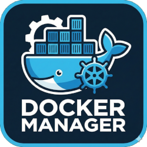

# 🐳 LightDockerWebUI

<p align="center">
  
</p>

<p align="center">
  <strong>A lightweight, elegant web interface for Docker container management</strong>
</p>

<p align="center">
  <a href="https://hub.docker.com/r/ftsiadimos/lightdockerwebui"></a>
  <a href="https://github.com/ftsiadimos/lightdockerwebui/blob/main/LICENSE"></a>
  <a href="https://www.python.org/"></a>
  <a href="https://flask.palletsprojects.com/"></a>
  <a href="https://getbootstrap.com/"></a>
</p>

---

## 🎯 Overview

LightDockerWebUI is a **clean, fast, and simple** web-based Docker management tool designed for home servers, development environments, and small deployments. No complex setup — just run and manage your containers from any browser.

### Why LightDockerWebUI?

| Feature | LightDockerWebUI | Portainer | Yacht |
|---------|------------------|-----------|-------|
| **Size** | ~50MB | ~300MB | ~150MB |
| **Memory** | ~30MB | ~100MB+ | ~80MB |
| **Setup** | 1 command | Multi-step | Multi-step |
| **Focus** | Simplicity | Enterprise | Moderate |

---

## ✨ Features

<table>
<tr>
<td width="50%">

### 📊 Dashboard
- Real-time container status
- Quick status indicators (running, stopped, paused)
- Port mappings with clickable links
- Container images and names at a glance

</td>
<td width="50%">

### 🎮 Container Control
- **Start** / **Stop** / **Restart** containers
- **Delete** containers with confirmation
- Bulk actions on selected containers
- Instant feedback with flash messages

</td>
</tr>
<tr>
<td width="50%">

### 📝 Live Logs
- Real-time log streaming
- Auto-scroll with manual override
- Timestamp display
- Search and filter logs

</td>
<td width="50%">

### 💻 Web Terminal
- Interactive shell access
- Full terminal emulation
- Execute commands directly
- No SSH required

</td>
</tr>
<tr>
<td width="50%">

### 🌐 Multi-Server Support
- Connect to multiple Docker hosts
- Easy server switching via dropdown
- Local socket or remote TCP
- Persistent server configuration

</td>
<td width="50%">

### 📱 Responsive Design
- Mobile-friendly interface
- Tablet optimized
- Touch-friendly controls
- Works on any screen size

</td>
</tr>
</table>

---

## Screenshot

<p align="center">
  
</p>
<p align="center"><em>Dashboard — View and manage all containers</em></p>

---

## 🚀 Quick Start

Get up and running in **30 seconds**:

```bash
docker run -d \
  --name lightdockerwebui \
  -p 8008:8008 \
  -v /var/run/docker.sock:/var/run/docker.sock \
  --restart unless-stopped \
  ftsiadimos/lightdockerwebui:latest
```

Then open **http://localhost:8008** in your browser. That's it! 🎉

---

## 📦 Installation Options

<details>
<summary><b>🐳 Docker (Recommended)</b></summary>

```bash
# Pull and run
docker pull ftsiadimos/lightdockerwebui:latest

docker run -d \
  --name lightdockerwebui \
  -p 8008:8008 \
  -v /var/run/docker.sock:/var/run/docker.sock \
  --restart unless-stopped \
  ftsiadimos/lightdockerwebui:latest
```

</details>

<details>
<summary><b>📄 Docker Compose</b></summary>

```yaml
# docker-compose.yml
version: '3.8'

services:
  lightdockerwebui:
    image: ftsiadimos/lightdockerwebui:latest
    container_name: lightdockerwebui
    ports:
      - "8008:8008"
    volumes:
      - /var/run/docker.sock:/var/run/docker.sock
      - ./data:/app/data  # Persist server configuration
    restart: unless-stopped
```

```bash
docker-compose up -d
```

</details>

<details>
<summary><b>🐍 From Source (Development)</b></summary>

```bash
# Clone repository
git clone https://github.com/ftsiadimos/lightdockerwebui.git
cd lightdockerwebui

# Create virtual environment
python -m venv venv
source venv/bin/activate  # Windows: venv\Scripts\activate

# Install dependencies
pip install -r requirements.txt

# Run application
flask run --host=0.0.0.0 --port=8008
```

</details>

---

## ⚙️ Configuration

### Connecting to Docker Hosts

LightDockerWebUI supports **multiple Docker servers**. Configure them through the web UI:

1. Click **Config** in the navigation bar
2. Add servers with a display name and connection details:
   - **Local**: Leave host empty to use \`/var/run/docker.sock\`
   - **Remote**: Enter IP/hostname and port (default: 2375 or 2376)
3. Select the active server from the dropdown

### Environment Variables

| Variable | Default | Description |
|----------|---------|-------------|
| \`FLASK_DEBUG\` | \`0\` | Enable debug mode (development only) |
| \`SECRET_KEY\` | (random) | Flask secret key for sessions |
| \`SQLALCHEMY_DATABASE_URI\` | \`sqlite:///serverinfo.db\` | Database connection string |

### Exposing Remote Docker Daemon

To manage containers on a remote host, enable TCP on the Docker daemon:

```bash
# Create systemd override
sudo mkdir -p /etc/systemd/system/docker.service.d
sudo tee /etc/systemd/system/docker.service.d/override.conf << EOF
[Service]
ExecStart=
ExecStart=/usr/bin/dockerd -H fd:// -H tcp://0.0.0.0:2375
EOF

# Reload and restart
sudo systemctl daemon-reload
sudo systemctl restart docker
```

> ⚠️ **Security Warning**: Use TLS (port 2376) for production. Unencrypted connections should only be used on trusted networks.

---

## 🏗️ Project Structure

```
lightdockerwebui/
├── app/
│   ├── __init__.py          # Flask application factory
│   ├── main.py              # Routes, WebSocket handlers
│   ├── models.py            # SQLAlchemy models (DockerServer)
│   ├── forms.py             # WTForms (AddServer, SelectServer)
│   ├── static/              # CSS, JavaScript, images
│   └── templates/           # Jinja2 HTML templates
├── config.py                # Flask configuration classes
├── start.py                 # Application entry point
├── requirements.txt         # Python dependencies
├── Dockerfile               # Container build file
└── docker-compose.yml       # Compose configuration
```

---

## 🛠️ Development

```bash
# Clone and setup
git clone https://github.com/ftsiadimos/lightdockerwebui.git
cd lightdockerwebui
python -m venv venv && source venv/bin/activate
pip install -r requirements.txt

# Run with hot reload
export FLASK_DEBUG=1
flask run --host=0.0.0.0 --port=8008
```

### Tech Stack

- **Backend**: Flask 3.x, Flask-SQLAlchemy, Flask-Sock
- **Frontend**: Bootstrap 5.3, DataTables, jQuery
- **Database**: SQLite (persistent server configuration)
- **Container**: Docker SDK for Python

---

## 🤝 Contributing

Contributions are welcome! Here's how:

1. **Fork** the repository
2. **Create** a feature branch: \`git checkout -b feature/awesome-feature\`
3. **Commit** changes: \`git commit -m 'Add awesome feature'\`
4. **Push** to branch: \`git push origin feature/awesome-feature\`
5. **Open** a Pull Request

### Ideas for Contribution

- [ ] Dark mode theme
- [ ] Container stats (CPU, memory)
- [ ] Docker Compose support
- [ ] Image management
- [ ] Container creation wizard
- [ ] TLS certificate management

---

## 📄 License

This project is licensed under the **MIT License** — see [LICENSE](LICENSE) for details.

---

## 💬 Support & Links

<p align="center">
  <a href="https://github.com/ftsiadimos/lightdockerwebui/issues">🐛 Report Bug</a> •
  <a href="https://github.com/ftsiadimos/lightdockerwebui/discussions">💡 Request Feature</a> •
  <a href="https://hub.docker.com/r/ftsiadimos/lightdockerwebui">🐳 Docker Hub</a>
</p>

<p align="center">
  ⭐ <strong>Star this repo if you find it useful!</strong> ⭐
</p>

---

<p align="center">
  Made with ❤️ by <a href="https://github.com/ftsiadimos">Fotis Tsiadimos</a>
</p>
