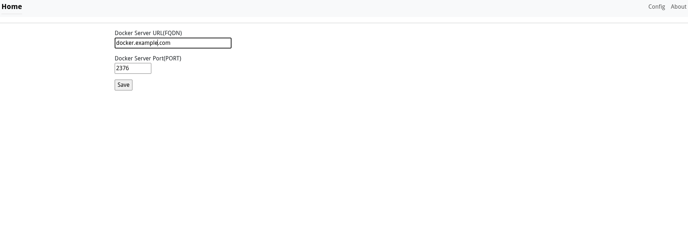

# LightDockerWebUI

A lightweight, user‑friendly web interface for monitoring and managing Docker containers.

> **TL;DR** – Pull the image, expose Docker over TCP, run the container, and open the UI in your browser.

---

## Table of Contents

- [Prerequisites](#prerequisites)
- [Installation](#installation)
- [Expose Docker Daemon](#expose-docker-daemon)
- [Running the UI](#running-the-ui)
- [Configuration](#configuration)
- [Screenshots](#screenshots)
- [License](#license)

---

## Prerequisites

- Docker Engine 20.10+ (or any recent version)
- `systemd` (for the Docker service override)
- A machine with network access to the Docker host

---

## Installation

```bash
# Pull the latest image from Docker Hub
docker pull ftsiadimos/lightdockerwebui:latest
```
## Expose Docker Daemon
If you want the UI to control containers on a remote host, expose the Docker socket over TCP:

1. Create or edit the override file:
```
sudo mkdir -p /etc/systemd/system/docker.service.d
sudo nano /etc/systemd/system/docker.service.d/override.conf
```

2. Add the following content:
```
[Service]
ExecStart=
ExecStart=/usr/bin/dockerd -H fd:// -H tcp://0.0.0.0:2376
```

3. Reload systemd and restart Docker:

```
sudo systemctl daemon-reload
sudo systemctl restart docker
```
Tip – Port 2376 is the default for Docker’s TLS‑enabled API.
If you need a different port, change 2376 accordingly.

## Running the UI

```
docker run -d \
  -p 8008:8008 \
  ftsiadimos/lightdockerwebui:latest
  ```

The UI will be available at http://<host>:8008.

## Configuration

Docker Host – In the UI, set the FQDN/IP and port of the Docker host you want to manage.
TLS – If you enabled TLS on the Docker daemon, provide the client certificates in the UI settings.

## Screenshots


Dashboard view – list of running containers, status, and actions.



Settings page – configure Docker host, TLS, and other options.

## License
MIT © 2025 FTSIADIMOS

Need help?
Open an issue on GitHub or reach out via the project’s discussion forum.
